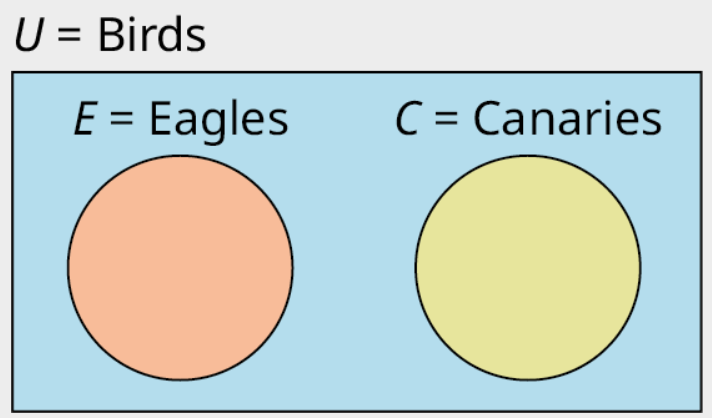

# Bayes Decision Theory

In this assignment we'll construct a Naive Bayes Classifier, using several ideas, but focus on to very important ideas from bayesian probability theory.
The first being **independence**, which in layman terms, essentially refers to the property of a probability for 
one thing occurring is unrelated and unaffected of the probability of another thing occurring. The second being **Bayes Theorem**,
which essentially describes the relationship between single probabilities and conditional probabilities. 

# Independence
## Exclusivity
Independence depends on the fact that the outcomes or possibilities of whatever space, universe or phenomenon we're interested in, are mutually exclusive. 
Essentially, in such a universe, any sample maps to a single outcome among many possible outcomes.
<br><br>
Formally, we can describe exclusiveness using set theory. A series of events $\big( A_1, A_2, ... , A_n \big)$ are mutually exclusive if their intersection is equal to an empty set.

$$ A_i \cap A_j =  \emptyset \quad \text{for all} \; i \neq j $$

<p align="center">
  
</p>
<p align="center">
  <em>Fig. 1: Illustration of mutual exclusivity.</em>
</p>

## Back to Independence
The concept of independence only holds when the various outcomes are mutually exclusive. In that case, independence allows us to express the probability of a conjunction $P(\mspace{5mu} A_1  \mspace{5mu} \cap \mspace{5mu}  A_2   \mspace{10mu} \cap \mspace{10mu}  ...   \mspace{10mu} \cap \mspace{5mu}  A_n  \mspace{5mu})$ as the product of their single probabilities
$$P(\mspace{5mu} A_1  \mspace{5mu} \cap \mspace{5mu} A_2  \mspace{10mu} \cap \mspace{10mu}  ...   \mspace{10mu} \cap \mspace{5mu}  A_n  \mspace{5mu}) = \prod_{i \in I} P(A_i) $$

# Bayes Theorem
## Conditional Probabilities
The strength of Bayes Theorem lies in its ability to update the probability estimate for an event as more information becomes available. This is achieved through the use of conditional probabilities. Conditional probability is the probability of an event occurring given that another event has already occurred.

The formula for conditional probability is given by:

$$ P(A \mspace{5mu}|\mspace{5mu} B) = \frac{P(A \mspace{5mu}\cap\mspace{5mu} B)}{P(B)} $$

where $P(A \mspace{5mu}|\mspace{5mu} B)$ is the probability of event A occurring given that B has occurred, and $P(A \mspace{5mu}\cap\mspace{5mu} B)$ is the probability of both events A and B occurring.

## Back to Bayes Theorem
Bayes Theorem is a way of finding a probability when we know certain other probabilities. The classic equation for Bayes Theorem is:

$$P(A \mspace{5mu}|\mspace{5mu} B) = \frac{P(B \mspace{5mu}|\mspace{5mu} A) \cdot P(A)}{P(B)}$$

This theorem allows us to update our prior beliefs with new evidence.

## Total Probability
The Law of Total Probability is a fundamental rule relating marginal probabilities to conditional probabilities. It states that the probability of an event can be found by considering all possible ways that the event can occur. For a set of mutually exclusive and exhaustive events $B_i$, the law is given by:

$$P(A) = \sum_{i \in \mathbb{I}} P(A | \mspace{5mu}|\mspace{5mu} B_i) \cdot P(B_i) $$

This theorem is particularly useful in scenarios where the probability of an event A is not directly known, but can be broken down into several mutually exclusive events $B_i$.

# Constructing Our Naive Bayes Classifier
## Our Starting Point
Given a set of features $\mathbf{X} = \big( x_1, x_2, ..., x_i \big)$ and set of target classes $\mathbf{Y} = \big( y_1, y_2, ..., y_k \big)$, we can begin constructing a Naive Bayes classifier.
We begin by defining our decision rule by the following expression
$$\hat{y} = \arg\max_{y} P(y | \mathbf{X} )$$
Which can then be expanded to
```math
\begin{align}
\hat{y} &= \arg\max_{y} P(y | \mathbf{X} )\\
&= \arg\max_{y}  \frac{P(\mathbf{X} | y ) \cdot P(y)}{P(\mathbf{X})}
\end{align}
```
## Putting it together
### Feature Independence
Assuming each feature $x_i \in \mathbf{X}$ is independent of the remaining features, then the  probability of the conjunction $P(\mathbf{X})$ can be expressed as
$$P(\mathbf{X}) = P(x_1, x_2, ..., x_i) = \prod_{i \in I} P(x_i)$$
And as a result the conditional probability of the conjunction $P(\mathbf{X} | y)$ can be expressed as
$$P(\mathbf{X} | y) = P(x_1, x_2, ..., x_i) = \prod_{i \in I} P(x_i | y)$$

### Applying total probability
Now we turn our attention to ther term in the numerator $P(\mathbf{X})$ which can be expressed as a sum of over the product of conditional and single probabilities
$$P(\mathbf{X}) = \sum_{k \in \mathbb{K}} P(\mathbf{X} \mspace{5mu}|\mspace{5mu} y_k) \cdot P(y_i)$$

## The Decision Rule
We can now substitute various components in order to arrive at the full expression
```math
\begin{align}
\hat{y} &= \arg\max_{y}  \bigg(\sum_{k \in \mathbb{K}} P(y_k \mspace{5mu}|\mspace{5mu} \mathbf{X}) \cdot P(y_i) \bigg)^{-1} \cdot P(y) \cdot \prod_{i \in I} P(x_i | y)
\end{align}
```
# Finishing Notes
In practice, we compute values for $P(y)$, $P(y | \mathbf{X}) \text{ and } P(x_i | y)$ directly from the dataset, and refer to them as priors. This then gives us everything 
we need in order to make use of our decision rule.


# References 
Figure 1: [Understanding Venn Diagrams](https://louis.pressbooks.pub/finitemathematics/chapter/5-3-understanding-venn-diagrams/)
